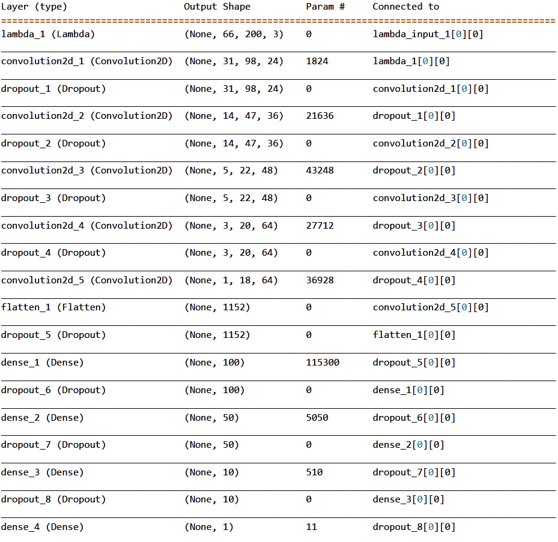
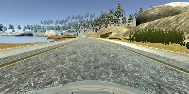
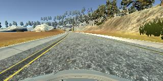
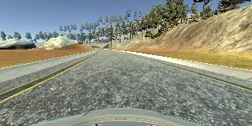
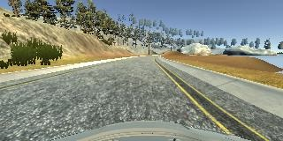

# Project: Behaviorial Cloning Project

Overview
---
This repository contains starting files for the Behavioral Cloning Project.

In this project, you will use what you've learned about deep neural networks and convolutional neural networks to clone driving behavior. You will train, validate and test a model using Keras. The model will output a steering angle to an autonomous vehicle.

We have provided a simulator where you can steer a car around a track for data collection. You'll use image data and steering angles to train a neural network and then use this model to drive the car autonomously around the track.

The Project
---
The goals / steps of this project are the following:
* Use the simulator to collect data of good driving behavior 
* Design, train and validate a model that predicts a steering angle from image data
* Use the model to drive the vehicle autonomously around the first track in the simulator. The vehicle should remain on the road for an entire loop around the track.
* Summarize the results with a written report

### Dependencies
This lab requires:

* [CarND Term1 Starter Kit](https://github.com/udacity/CarND-Term1-Starter-Kit)

The lab enviroment can be created with CarND Term1 Starter Kit. Click [here](https://github.com/udacity/CarND-Term1-Starter-Kit/blob/master/README.md) for the details.

The simulator can be downloaded from the classroom. In the classroom, we have also provided sample data that you can optionally use to help train your model.

---

Writeup
---

**Behaviorial Cloning Project**

---
### Files Submitted & Code Quality

#### 1. Submission includes all required files and can be used to run the simulator in autonomous mode

My project includes the following files:
* drive.py for driving the car in autonomous mode
* model.h5 containing the weights for the neural network 
* model.json containing the model architecture of the neural network 
* preprocessing.py containing all the required image preprocessing steps
* utils.py containing small functions as reading the data and minor validation functions
* train.py containing the script to create and train the model (overall file with main function)
* writeup_report.md or writeup_report.pdf summarizing the results

#### 2. Submission includes functional code
Using the Udacity provided simulator and my drive.py file, the car can be driven autonomously around the track by executing 
```sh
python drive.py model.json
```

#### 3. Submission code is usable and readable

The train.py file contains the code for training and saving the convolution neural network. The file shows the pipeline I used for training and validating the model, and it contains comments to explain how the code works.

### Model Architecture and Training Strategy

#### 1. An appropriate model architecture has been employed

As taken from the [End to End Learning for Self-Driving Cars](http://images.nvidia.com/content/tegra/automotive/images/2016/solutions/pdf/end-to-end-dl-using-px.pdf) paper the network consists of 9 layers, including a normalization layer, 5 convolutional layers, and 3 fully-connected layers. 

The first layer accepts an rgb image of size 66x200x3 and performs image normalization, resulting in features ranging from values -1.0 to 1.0, what is realized with a lambda expression.

After the CNN, the output is flattened and fed into fully-conncted-layers.
The last layer has as an output the steering angle.

The activation function used is the exponential linear unit (ELU), and an adaptive learning rate is used via the Adam optimizer
The weights of the network are trained to minimize the mean squared error

Finally, the used architecture contains about 27 million connections and 250 thousand parameters.


#### 2. Attempts to reduce overfitting in the model

In order to combat overfitting, the training data set is increased. First, the given training data set of Udacity is used, several rounds are recorded in order to increase the size of the dataset. This reduces the overfitting.

Moreover, a split for training/validation/test of the data is used, so the performance can be evaluated.
Through this, overfitting can also be detected and reduced with early stopping.

Furthermore, in the model architecture, several dropout are used, which is known for reducing the overfitting.

In the model, a L2 regularization reduces the overfitting further.

#### 3. Model parameter tuning

For hyperparameter tuning, an adam optimizer is used automatize it.
Most of the times, the epochs and samples per epochs were variated because they seem to have a huge effect on the performance.
The learning rate was modified, but is fine with the default value.

Due to the results in the mentioned paper, the model architecture was not modified largely.

#### 4. Appropriate training data

The 2/3 of the data set used for training is the one given by Udacity, but 1/3 is recorded manually.
First, a lot of self-recorded data was used, but the GIGO (Garbage In, garbage out) effect hits the performance.
Therefore, the training data was recorded with the mouse instead of the keyboard and the results were way better.

To enhance the given training data, some difficult parts of the road and some situations were the car is drive from the side of the lane to the middle of the lane (recovering) are added. This had very beneficial effects on the model. The difficult parts are passed way smoother.

For details about how I created the training data, see the next section. 

### Model Architecture and Training Strategy

#### 1. Solution Design Approach

My initial step was to try the known LeNet model from the traffic sign project. But the training with the Udadcity data was not so promising. 
Nevertheless, I added some preprocessing fucntion as the Lambda layer and Cropping layer. 
Well, it simply didn't work, so I did research and found the End to End learning paper by NVIDIA (see above).

I added the following image preprocessing steps to the model:
* Grayscaling
* Random brightness
* Cropping the image (cutting of unnecessary parts)
* Resizing for fitting into the model architecture

Furthermore, the probabilty that the image will be flipped is set to 0.5, so there will be no bias.

Moreover, the amount of low angles (below 0.1) is limited to 0.5 per batch because the data set is already biased with low angles.

At the end of the process, the vehicle is able to drive autonomously around the track without leaving the road.

#### 2. Final Model Architecture

The final model architecture (train.py lines 26-58) looks like this:



#### 3. Creation of the Training Set & Training Process

To capture good driving behavior, I first recorded two laps on track one using center lane driving. Here is an example image of center lane driving:



I then recorded the vehicle recovering from thethe sides of the road back to center so that the vehicle would learn how to react in this situation. These images show what a recovery looks like starting from the left side of the road:

From the left...


...slowly...



...to the middle



Then I repeated this process on track two in order to get more data points.

To augment the data sat, I also flipped images in order to reduce a potential bias.
For example, here is an image that has then been flipped:




After the collection process, around 15000 images are available for training, additionally to the Udacity training data.

I finally randomly shuffled the data set and put 10% of the data into a validation set. 

I used this training data for training the model. The validation set helped determine if the model was over or under fitting. The ideal number of epochs was between 15-20 (trained with 20).
I used an adam optimizer so that manually training the learning rate wasn't necessary.

Here, you can watch the result from the [video game perspective](https://youtu.be/9sIcmBxahaQ) or [vehicle view](doc/vehicle_view.mp4).